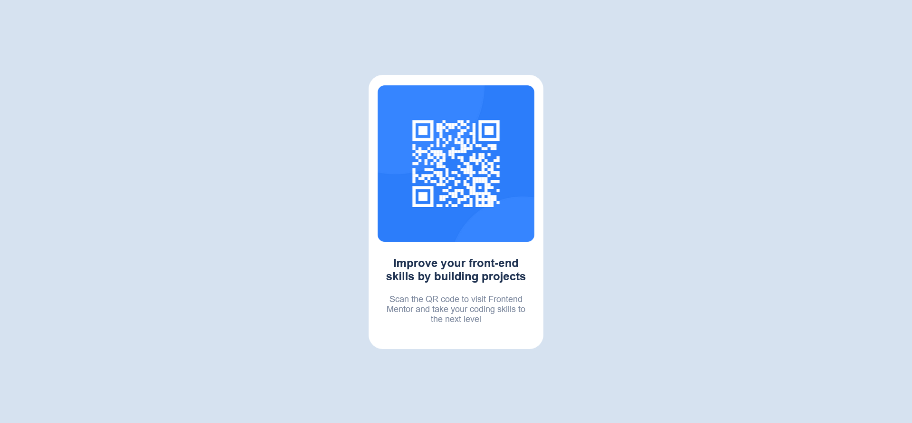

# Frontend Mentor - QR code component solution

This is my solution to the [QR code component challenge on Frontend Mentor](https://www.frontendmentor.io/challenges/qr-code-component-iux_sIO_H). Frontend Mentor challenges help you improve your coding skills by building realistic projects.

## Overview

### Links

- Solution URL: [solution URL](https://www.frontendmentor.io/solutions/responsive-barcode-using-css-grid-and-flexbox-ypb1X8O7q5)
- Live Site URL: [live site URL](https://coded-by-mj.github.io/Front-end-Mentor-Challenge1/)

## My process

### Built with

- Semantic HTML5 markup
- CSS custom properties
- Flexbox
- CSS Grid
- Mobile-first workflow

## Author

- Frontend Mentor - [@Coded-by-MJ](https://www.frontendmentor.io/profile/Coded-by-MJ)
- Twitter - [@MiracleJustice_](https://twitter.com/MiracleJustice_)
